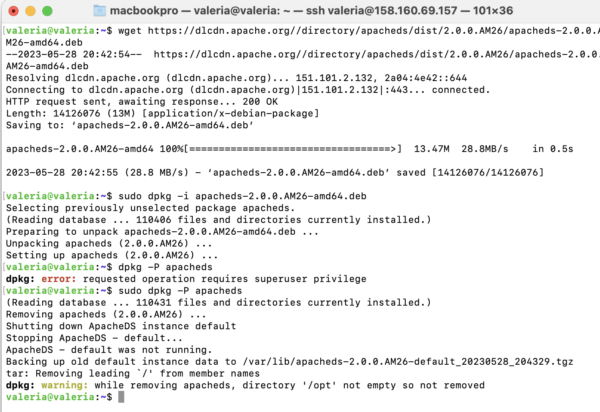
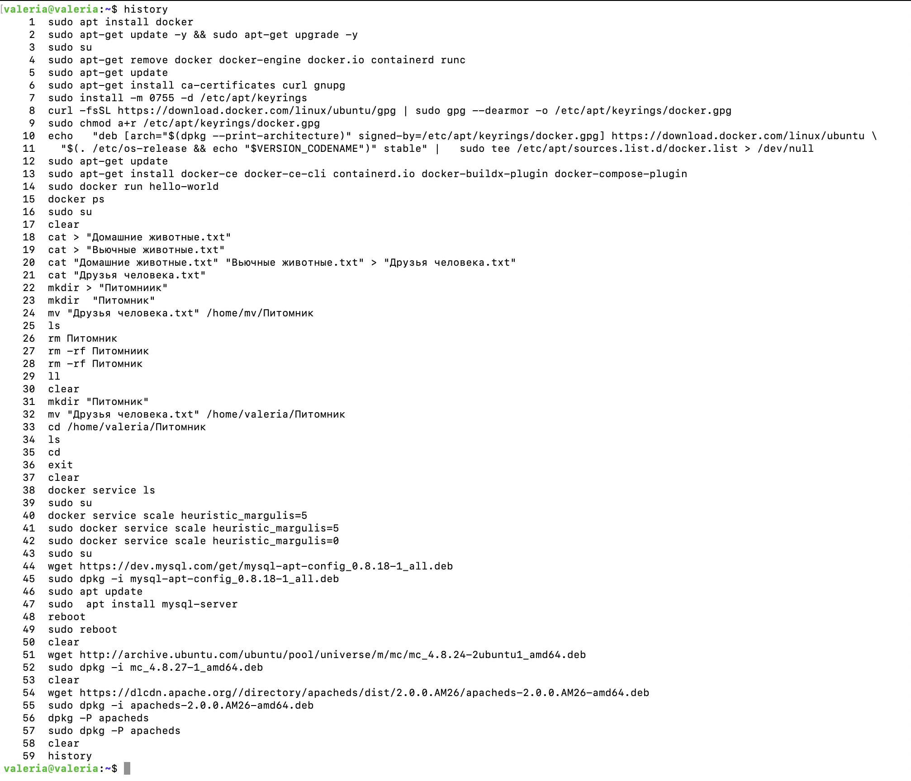

# Итоговая аттестация. Практическое задание

Задание
1. Используя команду cat в терминале операционной системы Linux, создать два файла Домашние животные (заполнив файл собаками, кошками, хомяками) и Вьючные животными заполнив файл Лошадьми, верблюдами и ослы), а затем объединить их. Просмотреть содержимое созданного файла. Переименовать файл, дав ему новое имя (Друзья человека).
2. Создать директорию, переместить файл туда.
3. Подключить дополнительный репозиторий MySQL. Установить любой пакет из этого репозитория.
4. Установить и удалить deb-пакет с помощью dpkg. 
5. Выложить историю команд в терминале ubuntu
6. Нарисовать диаграмму, в которой есть класс родительский класс, домашние животные и вьючные животные, в составы которых в случае домашних животных войдут классы: собаки, кошки, хомяки, а в класс вьючные животные войдут: Лошади, верблюды и ослы).
7. В подключенном MySQL репозитории создать базу данных “Друзья человека”
8. Создать таблицы с иерархией из диаграммы в БД
9. Заполнить низкоуровневые таблицы именами(животных), командами которые они выполняют и датами рождения
10. Удалив из таблицы верблюдов, т.к. верблюдов решили перевезти в другой питомник на зимовку. Объединить таблицы лошади, и ослы в одну таблицу.
11. Создать новую таблицу “молодые животные” в которую попадут все животные старше 1 года, но младше 3 лет и в отдельном столбце с точностью до месяца подсчитать возраст животных в новой таблице
12. Объединить все таблицы в одну, при этом сохраняя поля, указывающие на прошлую принадлежность к старым таблицам.
13. Создать класс с Инкапсуляцией методов и наследованием по диаграмме. 14. Написать программу, имитирующую работу реестра домашних животных. В программе должен быть реализован следующий функционал:
14.1 Завести новое животное
15.2 определять животное в правильный класс
16.3 увидеть список команд, которое выполняет животное 14.4 обучить животное новым командам
17.5 Реализовать навигацию по меню
18. Создайте класс Счетчик, у которого есть метод add(), увеличивающий̆ значение внутренней̆ int переменной̆ на 1 при нажатии “Завести новое животное” Сделайте так, чтобы с объектом такого типа можно было работать в блоке try-with-resources. Нужно бросить исключение, если работа с объектом типа счетчик была не в ресурсном try и/или ресурс остался открыт. Значение считать в ресурсе try, если при заведении животного заполнены все поля.

# Решение
1. Используя команду cat в терминале операционной системы Linux, создать два файла Домашние животные (заполнив файл собаками, кошками, хомяками) и Вьючные животными заполнив файл Лошадьми, верблюдами и ослы), а затем объединить их. Просмотреть содержимое созданного файла. Переименовать файл, дав ему новое имя (Друзья человека).

Выполнениие команды:

- cat > "Домашние животные.txt"
- cat > "Вьючные животные.txt"
- cat "Домашние животные.txt" "Вьючные животные.txt" > "Друзья человека.txt"
- cat "Друзья человека.txt"

2. Создать директорию, переместить файл туда.

Выполнениие команды:

- mkdir "Питомник"
- mv "Друзья человека.txt" /home/valeria/Питомник

3. Подключить дополнительный репозиторий MySQL. Установить любой пакет из этого репозитория.

Выполнение команды:

    wget https://dev.mysql.com/get/mysql-apt-config_0.8.18-1_all.deb
    
    dpkg -i mysql-apt-config_0.8.18-1_all.deb
    
    apt update
    
    apt install mysql-server
    
    

    

4. Установить и удалить deb-пакет с помощью dpkg. 

Выполнение команды:

    wget https://dlcdn.apache.org//directory/apacheds/dist/2.0.0.AM26/apacheds-2.0.0.AM26-amd64.deb
   sudo dpkg -i apacheds-2.0.0.AM26-amd64.deb
    sudo dpkg -P apacheds

5. Выложить историю команд в терминале ubuntu

6. Нарисовать диаграмму, в которой есть класс родительский класс, домашние животные и вьючные животные, в составы которых в случае домашних животных войдут классы: собаки, кошки, хомяки, а в класс вьючные животные войдут: Лошади, верблюды и ослы).

Диаграмма [тут]([друзья человека.drawio](https://github.com/Silva0308/summary/blob/40c53a95cc25a1e74aafb1718a01e102d762a44f/%D0%B4%D1%80%D1%83%D0%B7%D1%8C%D1%8F%20%D1%87%D0%B5%D0%BB%D0%BE%D0%B2%D0%B5%D0%BA%D0%B0.drawio))
